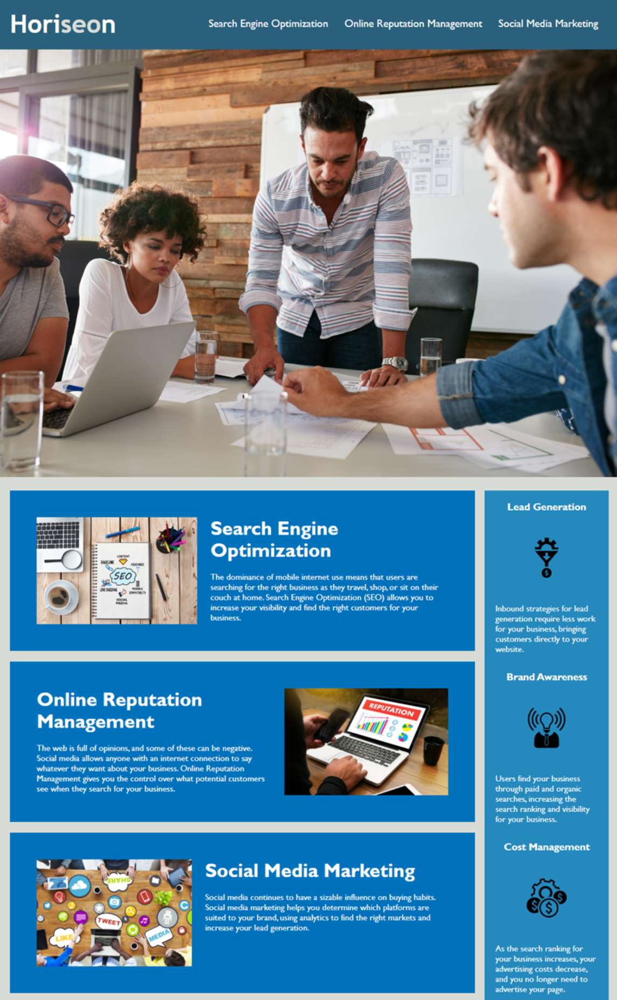

            

---

## Horiseon Social Solution Services, Inc. Codebase Refactor Project 

---

#### This was a refactoring project for Horiseon Social Solution Services, Inc., a startup marketing agency. The project scope sought to optimize the Horiseon website for search engines and ensure its codebase followed accessibility standards. 

#### Completion of the acceptance criteria implemented the following items:
#####   - Semantic HTML elements which follow a logical structure independent of styling and positioning
#####   - Accessible alt attributes on image elements
#####   - Heading attributes in sequential order
#####   - A concise, descriptive title on the title element

#### The following is a screenshot of Horiseon's website and overview of its functionality:

  
#### Articles and sites which contributed toward the successful completion of this project are included below:

[Semantic HTML](https://www.pluralsight.com/guides/semantic-html)   
[Learn CSS Layout](https://learnlayout.com/no-layout.html)  
[How To Style Images With Markdown Blog](https://www.xaprb.com/blog/how-to-style-images-with-markdown/)  
[Shields IO](https://shields.io/)  

#### [Refactor repo] - (https://onomatopoetica.github.io/01-code-refactor/)  
